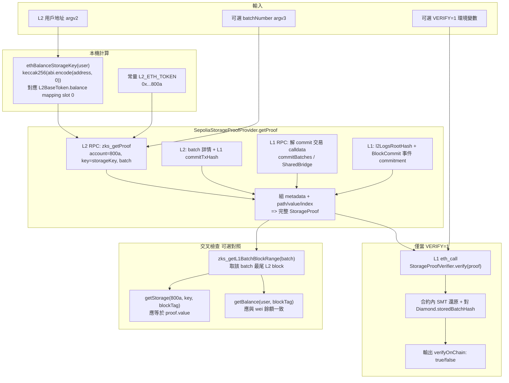

# `balance-proof-sepolia.cjs` 在做什麼（對照你嘅終端輸出）

腳本路徑：[balance-proof-sepolia.cjs](./balance-proof-sepolia.cjs)。下面流程圖對應一次典型執行（例如：`VERIFY=1 node scripts/balance-proof-sepolia.cjs 0xAF79...`，得到 `batchNumber` 14760、`verifyOnChain: true`）。

## 總覽流程圖

## 你份輸出逐行對應

| 終端機行 | 意義 |
|---------|------|
| `L2 ETH token: 0x...800a` | 證明標的合約：L2 原生 ETH（`L2BaseToken`）位址。 |
| `User: 0xAF79...` | `getAddress` 校驗後嘅用戶地址。 |
| `Balance storage key (slot): 0xded2...` | `balance[user]` 喺 storage trie 嘅槽位（mapping slot 0 規則）。 |
| `Proof value (wei): 0` | 喺所選 L1 batch 對應嘅 L2 狀態下，該槽位係 0（即餘額 0）。 |
| `getStorage ... block 5094064 : 0x00...` | 用該 batch 最尾 L2 block 讀同一槽，與 proof 一致。 |
| `getBalance ... : 0` | 同一 block 下帳戶 ETH 餘額，與 storage 一致。 |
| `metadata.batchNumber: 14760` | 呢份證明綁定嘅 **L1 batch**。 |
| `path: [...]` | Sparse Merkle Tree 由葉到根嘅證明路徑。 |
| `verifyOnChain: true` | L1 驗證合約確認：proof + metadata 與鏈上已提交 batch 吻合。 |

## 點解 `value` 係 0 仍然有意義

證明嘅內容係「**喺歷史狀態 batch 14760 呢一刻**，`0xAF79...` 喺 `0x800a` 嘅 balance slot 係 0」——唔係「而家一定有錢」。要證明非零餘額，要用有錢嘅地址，或者揀一個當時確實有餘額嘅 batch（手動傳 `batchNumber`）。
