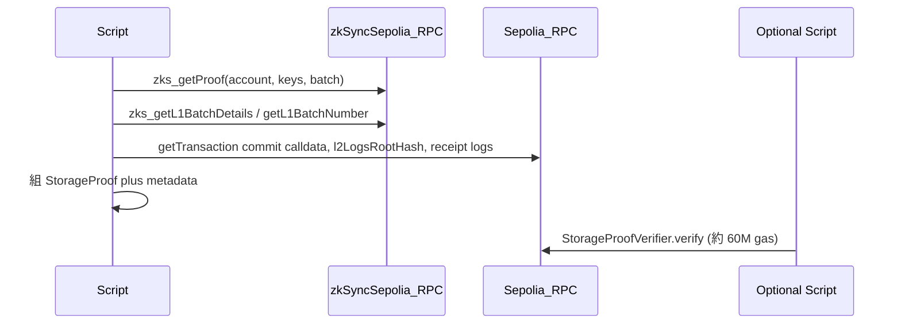

# zkSync 儲存證明 → 餘額證明 → ENS Resolver 學習計畫

## 與 Clave 產品敘事的對照（避免學習路徑與「錢包故事」脫節）

以下對齊你補充的三段背景：**本計畫仍是技術主線（storage proof + resolver）**，但應放在 Clave / ZKsync 大圖裡理解邊界。

| 產品層敘事（你新增的知識） | 與本計畫的關係 |
| --- | --- |
| **ZKsync 原生 AA**、Bootloader 調 `validateTransaction` / `executeTransaction`、Passkey 寫入 AA 錢包合約 | 屬**帳戶執行與驗證**；本 repo **不實作**這條鏈。若要「證明錢包內某 mapping」，要另選 **AA 合約地址 + 對應 storage slot**，與階段二的 `0x800a` 餘額槽位**不是同一回事**。 |
| **ContractDeployer / createAccount**、Relayer、Paymaster 代付 | 屬**部署與交易提交路徑**；與 **L1 上 `StorageProofVerifier.verify`（~60M gas）**、gateway 回傳 proof 是**不同子系統**。 |
| **CREATE2 跨鏈同址**、鏈抽象 | 多條 EVM 上 **同一 0x** 時，ENS **多鏈 `addr(node, coinType)` 可能內容重複**仍屬正常；**Solana 等**仍要獨立編碼／槽位（見 `MultichainNameRegistry`）。 |
| **ENS + CCIP-Read**（官方文件常舉 **反向解析 reverse**） | 本計畫範例是 **正向 wildcard：ENSIP-10 `resolve(bytes,bytes)`** + EIP-3668。兩者都叫 CCIP-Read，但**解析方向與合約介面不同**；讀 ENS 文檔時不要假設只有 reverse 一條路。 |
| **用戶名 → L2 註冊表、再綁 AA 地址** | 概念上對應「名字與鏈上狀態的對應」；本計畫用 **可驗證的 L2 storage proof** 把「名字對應的槽位值」接回 L1，與純簽名型 offchain-resolver **信任假設不同**。 |

## 現有程式碼你會用到的部分

| 元件                        | 路徑                                                                                                                                       | 角色                                                                                                                              |
| ------------------------- | ---------------------------------------------------------------------------------------------------------------------------------------- | ------------------------------------------------------------------------------------------------------------------------------- |
| TS 取證明 + 組 batch metadata | `[zksync-storage-proofs/packages/zksync-storage-proofs/src/index.ts](zksync-storage-proofs/packages/zksync-storage-proofs/src/index.ts)` | `zks_getProof`、從 L1 Diamond 解析 `commit` / `l2LogsRootHash`、組 `StorageProof`                                                     |
| 型別                        | `[types.ts](zksync-storage-proofs/packages/zksync-storage-proofs/src/types.ts)`                                                          | `StorageProof`、`BatchMetadata`                                                                                                  |
| 測網預設                      | `index.ts` 底部                                                                                                                            | `SepoliaStorageProofProvider`：L1 `publicnode`、L2 `https://sepolia.era.zksync.dev`、Diamond `0x9A6D...`、Verifier `0x5490...`      |
| L1 驗證合約                   | `[StorageProofVerifier.sol](zksync-storage-proofs/packages/zksync-storage-contracts/src/StorageProofVerifier.sol)`                       | 用 SMT 還原 leaf，再比對 `storedBatchHash(batchNumber)`                                                                                |
| ENS + 儲存證明範例              | `[ClaveResolver.sol](zksync-storage-proofs/packages/zksync-storage-contracts/src/ens/ClaveResolver.sol)`（薄包裝：`packages/clave-ens-resolver/ClaveResolver.sol`） | EIP-3668 `OffchainLookup` → gateway 回傳 `(StorageProof, fallback)` → `resolveWithProof` 覆寫 `account`/`key` 後驗證；`extraData` 為 `abi.encode(registry, storageKey, coinType)` |
| L2 多鏈名字註冊（演練用） | `[MultichainNameRegistry.sol](zksync-storage-proofs/packages/zksync-storage-contracts/src/ens/MultichainNameRegistry.sol)` | 每個 label + `coinType` 一個 `bytes32` 槽；與 `ClaveResolver.getMultichainDomainSlot` 對齊 |
| 標準 CCIP-Read 參考           | `[offchain-resolver/README.md](offchain-resolver/README.md)`                                                                             | gateway / 合約 / client 流程（簽名版；與 Clave 的「鏈上驗 storage proof」不同但流程形狀相同）                                                             |

---

## 階段一：在測網「只跑通 pipeline」（建議第一步）

目標：不依賴自推 storage slot，先理解 **batch 延遲、metadata、proof 形狀**。

1. **安裝與建置**（在 `[zksync-storage-proofs/packages/zksync-storage-proofs](zksync-storage-proofs/packages/zksync-storage-proofs)`）：`yarn` / `npm install` 後 `yarn build`（或根目錄 workspace 若有統一指令則跟 repo 慣例）。
2. **複製 README 範例**：用 `SepoliaStorageProofProvider.getProof` 對 README 已給的 `account` + `storageKey`（`[README.md](zksync-storage-proofs/packages/zksync-storage-proofs/README.md)` 第 23–27 行）；可傳入第三參數 `batchNumber` 做實驗，或省略讓程式用 `latestL1Batch - BLOCK_QUERY_OFFSET`（約 150，對應「已上 L1 可驗證」的 batch）。
3. **列印並檢查**：`metadata`、`path`、`value`、`index` 與 L2 RPC 回傳是否一致。
4. **（可選）`verifyOnChain`**：README 註明需 **約 60M gas**，且 **多數 public RPC 會拒絕**；需準備 **Sepolia 上可跑高 gas `eth_call` 的節點**（README 提到 Infura 可測）。若暫時無法跑通，仍可把階段一視為完成——你已掌握取證明與資料結構。

---

## 階段二：針對「帳戶 ETH 餘額」的 storage key（在測網）

目標：把「要證明的值」從任意系統槽位，換成 **某地址在 L2 原生 ETH 代幣合約上的 balance 槽位**。

- **合約地址**：與你專案 `[multicall.ts](zksync-smart-wallet/src/utils/multicall.ts)` 一致，L2 上 ETH 以系統合約表示時常為 `**0x000000000000000000000000000000000000800a`**（請以官方 / explorer 標示為準）。
- **Storage key 計算**：對 `mapping(address => uint256)` 佔用槽位 `p`、使用者 `a`，標準為  
`keccak256(abi.encode(a, p))`（Solidity layout：`abi.encode` 的 address 會左補齊到 32 bytes）。  
**實務上必須對照 Matter Labs `L2BaseToken` / `IL2BaseToken` 原始碼確認 `balances` 對應的基槽 `p`**（不同版本編譯配置可能不同）；不要用猜的 slot。
- **驗證方式**：
  - 用 L2 `eth_getStorageAt(0x800a, slotKey, blockTag)`（選與所選 L1 batch 對應的 L2 區塊，或先以 `latest` 做粗對齊）比對 `getProof` 回傳的 `value`。
  - 與 `provider.getBalance(user)` 在**同一區塊**比對語意（注意 wei 與 storage 裡的編碼是否一致）。

完成標準：對**你自己控制的測網地址**（或已知有余額的地址）能穩定取得 `StorageProof`，且 `value` 與 `getStorageAt` 一致。

---

## 階段三：銜接到 ENS / Resolver（複雜邏輯的入口）

此階段不是立刻改 `offchain-resolver` 全棧，而是對齊 **同一個信任模型**：

1. **讀懂 `ClaveResolver` 與 `resolveWithProof`**：gateway 回傳的 `StorageProof` 在鏈上會被 **強制覆寫** `proof.account` / `proof.key`（與 `[StorageProofVerifier` README](zksync-storage-proofs/packages/zksync-storage-contracts/README.md) 建議一致），避免惡意 gateway 指向錯槽位。
2. **對照 `offchain-resolver`**：同樣是 `OffchainLookup`，但預設 gateway 是 **簽名斷言**；Clave 路線是 **L1 view 內驗 L2 狀態根路徑**（gas 極高，僅適合 view / 客戶端模擬或可接受的專用節點）。
3. **建議演練順序**：
  - 本地跑 `[offchain-resolver](offchain-resolver)` 的 `yarn start:node` + client（熟悉 CCIP-Read 往返）。
  - 再設計「迷你 gateway」：對固定 `name` + `coinType` 回傳你在階段二／registry 槽位產生的 `StorageProof`（與 `ClaveResolver` 的 `abi.decode` 格式一致；`extraData` 含 `coinType` 以決定 ERC-2304 回傳長度），在 Sepolia 上部署 resolver + verifier（步驟與參數見 `[zksync-storage-contracts/README.md](zksync-storage-proofs/packages/zksync-storage-contracts/README.md)` 的 **Deployment / ENS** 小節）。

---

## 風險與注意事項（寫進你的實驗筆記）

- **Batch 與延遲**：`getProof` 必須對應 **已 commit 且已 prove** 的 L1 batch；library 用 `latest - 150` 是經驗偏移，若失敗可改用手動挑較舊的 `batchNumber`。
- `**parseCommitTransaction` 的 `console.log`**：`[index.ts` 第 120 行](zksync-storage-proofs/packages/zksync-storage-proofs/src/index.ts) 會印大量 calldata，學習用可接受，之後若要當庫用可再關掉。
- **L1 驗證成本**：`verify` 不適合放在高頻交易路徑；產品上多為客戶端、`eth_call`、或離線證明服務。

---

## 建議產出物（方便你之後接 ENS）

- 一支小腳本（例如 `scripts/balance-proof-sepolia.ts`）：輸入 `address`、`batchNumber?`，輸出 JSON `StorageProof`。
- 簡短紀錄：使用的 L1/L2 RPC、成功的 `batchNumber` 範圍、`L2BaseToken` 的 `p` 來源（commit hash / 合約連結）。

